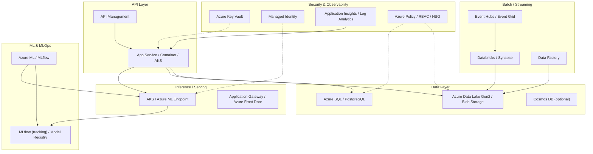

# Arquitetura-alvo Azure & FinOps

Este documento descreve a arquitetura alvo em Azure para a plataforma de experimentação adaptativa (MAB), o plano de gestão de segredos e uma estimativa qualitativa FinOps.

## Resumo rápido
- Objetivo: Mapear camadas de API, dados e IA em Azure, definir gestão de segredos (Key Vault + Managed Identity) e fornecer uma estimativa qualitativa de custos para suportar decisões de FinOps.
- Entregáveis: diagrama Mermaid, plano de segredos, análise qualitativa de TCO/ROI e checklist de validação.

## Diagrama (Mermaid)

> Observação: ajuste o diagrama com os serviços concretos que sua organização prefere (por exemplo, substituir Databricks por Synapse, ou AKS por App Service). O diagrama foca em camadas: API, Inference, Dados, Processamento, MLOps e Segurança.

## Plano de gestão de segredos (Key Vault + Managed Identity)

1. Padrão recomendado
   - Centralizar todos os segredos em `Azure Key Vault` (chaves, connection strings, certificados, secrets do ML).  
   - Para cada recurso (AKS, App Service, Azure Function, VM), habilitar `System-assigned Managed Identity` ou `User-assigned Managed Identity`.  
   - Conceder ao Identity apenas a permissão `get/list` necessária no Key Vault (princípio do menor privilégio).

2. Passos técnicos
   - Criar um `Key Vault` por ambiente (dev, staging, prod) ou usar um vault multi-tenant controlado por subscription/management group.  
   - Habilitar soft-delete e purge-protection no Key Vault.  
   - Registrar `Access Policies` ou usar `Azure RBAC for Key Vault` (recomendado para governança moderna).  
   - Rotacionar segredos automaticamente via Azure Automation/Logic Apps ou integração com CI/CD (ex.: pipeline Azure DevOps/GitHub Actions).  
   - Armazenar apenas o mínimo de segredos; preferir conexões com Managed Identities quando possível (ex.: para Azure SQL/MSSQL via AAD auth).

3. Fluxo de uso (exemplo)
   - `AKS` possui `Managed Identity` -> solicita `secret` do `Key Vault` em runtime -> aplica secret como environment variable ou Kubernetes Secret via CSI driver do Key Vault.

4. Auditoria e alertas
   - Habilitar diagnostic logs do Key Vault para `Log Analytics`.  
   - Configurar alertas para acessos suspeitos e para expiração/rotação de chaves.

## Estimativa qualitativa de custo e FinOps (ROI / TCO)

### Principais drivers de custo
- Armazenamento de dados (Azure Data Lake Gen2 / Blob) — custo por TB e I/O.  
- Processamento (Databricks / Synapse) — custo de clusters/compute (principal driver em workloads ML).  
- Serviços de hosting (AKS / App Service) — nó(s) de computação e autoscaling.  
- Rede (egress) — tráfego entre regiões e exposição externa.  
- Serviços gerenciados (Azure ML, API Management, Key Vault, Log Analytics) — custo por instância/volume de logs.

### Abordagem qualitativa para ROI / TCO
1. Identificar benefícios (receita incremental ou economia): ex.: aumento de conversão, redução de custos de campanhas, otimização de processos manuais.  
2. Estimar ganhos por hipótese (ex.: +0.5% de conversão → X EUR/ano).  
3. Estimar custos anuais (storage + compute + serviços gerenciados + operação).  
4. Calcular payback simples e indicadores qualitativos (por ex., custo por ponto percentual de conversão).  

> Exemplo rápido (hipotético):
- Custo anual estimado (piloto): Storage 0.5 TB + Databricks compute (equipe de experimentação) + serviços gerenciados ≈ 10k–30k EUR/ano (varia fortemente com escala).  
- ROI: se a plataforma aumentar receita em >30k EUR/ano, projeto justifica o custo de operação.

### Como obter estimativas concretas
- Use o `Azure Pricing Calculator` para cada serviço e as configurações esperadas (nós AKS, horas de Databricks, volume de armazenamento, logs ingestão).  
- Adicione custos de operação (pessoal: engenheiro de dados, ML engineer, DevOps) no TCO.  
- Revisar com FinOps local (tags, budgets, alertas e cost center allocation).

## Checklists e Critérios de Aceite (DoD)
- [ ] `docs/architecture-azure.md` contém diagrama Mermaid mapeando camadas de API, Dados e IA.  
- [ ] Plano de gestão de segredos documentado (Key Vault + Managed Identity).  
- [ ] Estimativa qualitativa FinOps incluída (princípios de ROI/TCO e próximos passos para cálculo detalhado).

## Próximos passos recomendados
1. Revisar este documento com o time de Cloud/Infra para ajustar serviços corporativos aprovados.  
2. Preencher parâmetros concretos (número de nós, horas esperadas de processamento, tamanho de storage) e rodar o `Azure Pricing Calculator`.  
3. Produzir um slide resumo (1–2 páginas) com a estimativa de custo e o racional de ROI para o Demo Day.  
4. Implementar políticas de observability e alertas (Log Analytics, budgets, Azure Policy).  

---

Se quiser, eu posso:  
- adaptar o diagrama Mermaid para a topologia exata da sua organização,  
- gerar a planilha de custos base (modelo CSV) pronta para importar no `Azure Pricing Calculator`,  
- ou criar os arquivos iniciais de IaC (ARM/Bicep/Terraform) para provisionar o `Key Vault` e `Managed Identity` básicos.
