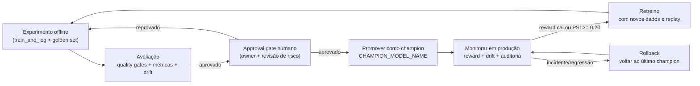

# MLOps — Infraestrutura local e quality gates

## Subindo a infra local

```powershell
docker compose up -d mlflow prometheus grafana
```

Sobe três serviços:

| Serviço | URL | Login |
| --- | --- | --- |
| MLflow UI | http://localhost:5000 | — |
| Prometheus | http://localhost:9090 | — |
| Grafana | http://localhost:3000 | admin / admin |

O backend do MLflow é SQLite persistido no volume `mlflow-data`. Para zerar tudo: `docker compose down -v`.

## Quality gates

Roda local antes de abrir PR:

```powershell
ruff check src tests
black --check src tests
mypy src --ignore-missing-imports
bandit -r src -c pyproject.toml
pytest tests --cov=src --cov-fail-under=30
```

Mesmo pipeline roda no GitHub Actions (`.github/workflows/ci.yml`) a cada push/PR para `main` ou `develop`. Falha em qualquer gate bloqueia o merge.

Para automatizar localmente:

```powershell
pre-commit install
```

A partir daí ruff/black/bandit rodam antes de cada commit.

## Tracking MLflow

Treinos passam pelo helper `train_and_log` em `src/models/train.py`, que aplica o conjunto mínimo de tags exigido pela banca:

- `model_name`, `model_type`, `framework`
- `owner` (email do responsável)
- `risk_level` (low / medium / high / critical)
- `fairness_checked` (bool)
- `training_data_version`
- `git_sha`, `phase`, `group`

Métricas padrão registradas para classificação: `auc`, `precision`, `recall`, `f1`.

## Drift detection

`src/monitoring/drift.py` calcula PSI por coluna entre referência (treino) e dados atuais:

- PSI < 0.10 → estável
- 0.10 ≤ PSI < 0.20 → warning
- PSI ≥ 0.20 → trigger de retraining

`DriftReport.to_metrics_dict()` formata o resultado para logar direto no MLflow junto com as métricas do modelo. Para relatório visual há `run_evidently_drift_report` (Evidently `DataDriftPreset`).

## Ciclo de vida da política

O fluxo operacional da política segue um gate humano antes de qualquer promoção para produção controlada:



### Experimento e validação

Cada nova hipótese entra como experimento rastreado no MLflow por meio de `train_and_log` em `src/models/train.py`. O run registra parâmetros, métricas, tags obrigatórias e o `git_sha`, o que permite auditar exatamente qual versão do código e dos dados gerou a política candidata.

Antes da promoção, a candidata precisa passar pelos quality gates locais e pela avaliação offline no golden set. O objetivo é comparar a política nova com a atual em três dimensões:

1. Qualidade preditiva ou de decisão, com as métricas já registradas no MLflow.
2. Estabilidade do comportamento, usando os sinais de drift calculados em `src/monitoring/drift.py`.
3. Segurança de negócio, com revisão humana do owner antes do promote.

### Approval gate e promoção

A promoção não é automática. O approval gate exige revisão humana para confirmar que a política candidata:

1. Melhorou a métrica principal sem degradar fairness, risco ou estabilidade.
2. Está associada a um run de MLflow com tags completas de rastreabilidade.
3. Pode substituir o champion atual sem violar o budget de risco do experimento.

Quando aprovada, a nova política é promovida como champion e o nome da versão aprovada passa a ser exposto por `CHAMPION_MODEL_NAME`.

### Monitoramento em produção

Em produção, o acompanhamento combina três sinais:

1. Reward: taxa de conversão, receita incremental, CTR ou a métrica de retorno definida para a política.
2. Drift: PSI por coluna via `compute_psi`, com `PSI_WARNING = 0.10` e `PSI_RETRAIN_TRIGGER = 0.20`.
3. Auditoria: logs de decisão e run_id do MLflow para reconstruir o contexto de cada versão promovida.

O monitoramento de recompensa deve olhar tendência e não apenas valor pontual. Sinais de alerta são queda sustentada da reward média, aumento de reward delay e piora simultânea do drift share.

### Retreino

O retreino é disparado quando uma destas condições ocorre:

1. Uma coluna crítica cruza o limiar de drift (`PSI >= 0.20`).
2. A reward permanece abaixo do baseline por uma janela definida de observação.
3. Mudanças de campanha, sazonalidade ou mix de canal tornam a política antiga não representativa.

O novo treino sempre deve reutilizar a trilha de MLflow, comparar com o champion anterior e registrar se a política candidata melhora reward sem piorar o risco operacional.

### Rollback

Se a política promovida regredir, o rollback volta imediatamente para o último champion aprovado. O gatilho de rollback é qualquer um destes eventos:

1. Queda abrupta da reward.
2. Drift persistente em múltiplas colunas.
3. Erro operacional, schema incompatível ou degradação de latência.

O rollback deve ser reversível e rápido: a versão anterior permanece rastreada no MLflow e o endpoint de serving apenas troca a referência da política ativa.

### Evidência de operação

Os runs de MLflow são parte central da narrativa de operação porque cada ciclo deixa evidência para auditoria e decisão:

1. Parâmetros e métricas do treino.
2. Tags de governança, owner e risco.
3. Sinal de drift agregado para acompanhar a saúde da política.
4. Referência da versão aprovada para promoção ou rollback.

Com isso, uma hipótese nova consegue sair de experimento para produção controlada com aprovação humana, monitoramento contínuo e caminho claro de reversão.
